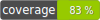

# Threader BOT
 

ThreaderBot is a Twitter bot that responds to mentions with links by summarizing those links in a thread of tweets.

## Requirements

- PHP 7.4+
- composer

## Installation instructions

- clone this repo
- run `composer install`
- Run tests with `composer run test`

## Configuration

Copy `scripts/.env` into `scripts/.env.local` and overwrite given values with your Twitter API access tokens (both v1 and v2 are needed).

## Execution

Run the script scripts/twitter_mentions.php at fixed intervals, it will look for new mentions and publish summarization threads in response:

```
php scripts/twitter_mentions.php

```


## How it works

When a new Twitter mention with a link is received, the content is retrieved and parsed in three phases (see [ChainTextExtractor](https://github.com/NachoBrito/ttbot/blob/main/src/Article/Infraestructure/ChainTextExtractor.php) and [TextRankSummarizer.php](https://github.com/NachoBrito/ttbot/blob/main/src/Article/Infraestructure/TextRankSummarizer.php)):

- First, a readability implementation is used to remove all ads and non-relevant text from the HTML document.
- After that, an HTML2Text extractor is used to get the clean text without HTML markup
- The final step is to use a TextRank summarizer to extract the most relevant sentences in the text.

Once the summary is generated, a new collection of tweets is published as a thread in response to the original mention.

## Technical details

The project's architecture is heavily inspired by [A. Cockburn's hexagonal architecture](http://alistair.cockburn.us/hexagonal-architecture/), plus some commonly used patterns:

- [Dependency Injection](https://en.wikipedia.org/wiki/Dependency_injection): Current implementation uses Symfony's container. See [scripts/inc/services.php](https://github.com/NachoBrito/ttbot/blob/main/scripts/inc/services.php) for runtime setup.
- [Command Query Responsibility Segregation](https://en.wikipedia.org/wiki/Command%E2%80%93query_separation#Command_query_responsibility_separation): The application is accessed "from the outside" with either a Command or a Query. The current implementation uses Symfony's Messenger component for dispatching. See [SymfonyCommandBus.php](https://github.com/NachoBrito/ttbot/blob/main/src/Common/Infraestructure/Symfony/SymfonyCommandBus.php), [SymfonyQueryBus.php](https://github.com/NachoBrito/ttbot/blob/main/src/Common/Infraestructure/Symfony/SymfonyQueryBus.php)

A rate-limiting feature is also implemented, with Symfony's rate limiter component. Currently, the [token bucket algorithm](https://en.wikipedia.org/wiki/Token_bucket) is applied to prevent excessive user access.